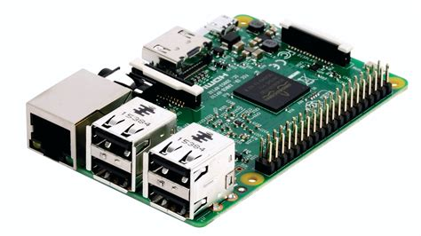

### Hardware utilisé

{.pull-right width=180px}

Pour le moment la machine utilisé est un Raspberry Pi 3 model B.

### OS

Télécharger une image Rasbian et flasher l'OS sur une carte MicroSD (taille mini 4GO).

### Configuration du système

Utilisateur principal:

 * **username** : viesco
 * **password** : _à demander aux référents numériques_

### Mise en place du _"mode kiosque"_

#### GUI

Dans "Préférences > Configuration du Raspberry Pi", onglet "Localisation" :

 * Configuration du fuseau horaire : "Indian/Mayotte"

#### CLI

##### Configuration du proxy

Dans `/etc/environment`

```bash
export http_proxy="http://10.209.155.254:3128"
export https_proxy="http://10.209.155.254:3128"
export ftp_proxy="http://10.209.155.254:3128"
```

Dans `/etc/sudoers` (conserve les paramètres avec `sudo`)

```bash
Defaults env_keep = "http_proxy https_proxy ftp_proxy"
```

Pour APT, créer un fichier `/etc/apt/apt.conf.d/10proxy` avec

```bash
Acquire::http::proxy "http://10.209.155.254:3128";

Acquire::https::proxy "http://10.209.155.254:3128";

Acquire::ftp::proxy "http://10.209.155.254:3128";
```

Logout pour prendre en compte la configuration et mise à jour :

`sudo apt-get update`
`sudo apt-get upgrade`

##### Configuration pour mode kiosque

Installation des outils

`sudo apt install xdotool unclutter sed`

Activer le login automatique avec raspi-config

`sudo raspi-config`

=> `1 System Options -> S5 Boot / Auto Login -> B4 Desktop Autologin`

##### Lancement au boot

Placer le fichier permettant le lancement du mode kiosque, `kiosk.sh`, dans le répertoire `$HOME` (`/home/viesco/`).

Placer le fichier `kiosk.service` dans `/lib/systemd/system/kiosk.service` et vérifier le droit d'exécution `chmod +x kiosk.sh`.

Activation du service : `sudo systemctl enable kiosk.service`.

Lancer le service : `sudo systemctl start kiosk.service`

### Désactiver le message "low-voltage warning"

Si l'alimentation du Rasberry Pi n'est pas de 5V et au moins 2.5A, un message de "low voltage" apparaît. Ce manque de puissance dans l'alimentation électrique réduit la vitesse du CPU : mieux vaut remplacer l'alimentation.

Toutefois si on souhaite masquer ce message, il est possible d'ajouter la valeur `avoid_warnings` à `1` dans le fichier `/boot/config.txt` :

```
avoid_warnings=1
```

Puis désactiver le plugin "battery monitor" : `sudo apt-get remove lxplug-ptbatt`

Enfin, rebooter le raspberry pi.
